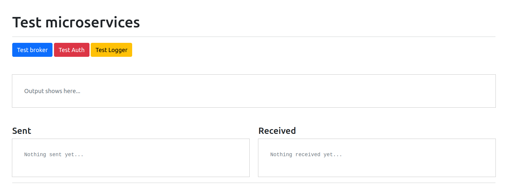

# Micro-services with golang
This is an example on how to build micro-services using golang.

## How to build services ?
From `build directory` run the follwing commandes:

* Run the front-end service with : 
```
make start
```

* Run other services :
```
make up_build
```


